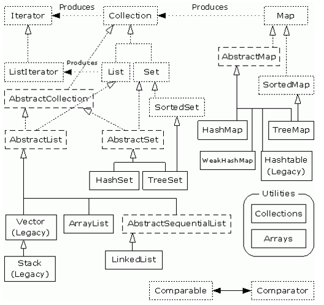

[TOC]

#概览

#List
#Collectoins.synchronized
#迭代器
#迭代器模式
#Fast-fail
#Map
#ConcurrentHashMap真的万无一失吗？
#ConcurrentHashMap的弱一致性
#Set
#比较器Comparable接口与Comaprator接口
#Queue
#BlockingQueue
| 类名 | 特点 |适用场景 |
|--------|--------|--------|
|ArrayBlockingQueue|基于数组;生产端消费端共用锁对象;|普通生产者-消费者场景|
|LinkedBlockingQueue|基于链表；生产端消费端不同锁对象;不指定大小易导致内存耗尽;|普通生产者-消费者场景|
|PriorityBlockingQueue|基于优先级的无界阻塞队列;只阻塞消费端;不阻塞生产端;|有优先级需要|
|DelayQueue|基于超时的无界阻塞队列;只有超时元素可以取出;|有超时需要场景|
|SynchronousQueue|无缓冲的等待队列;|线程间安全的交换单一元素场景|
#BlockingQueue在线程池中的使用
#Collectoins工具类